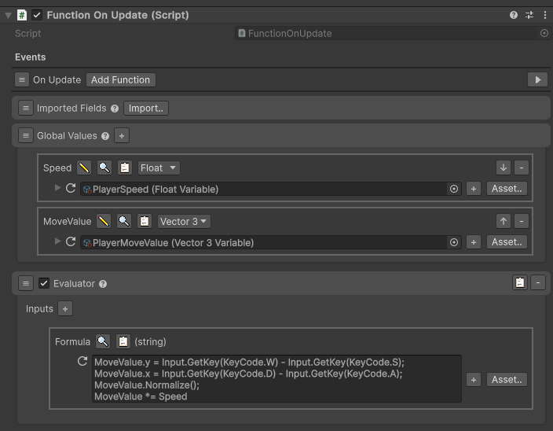
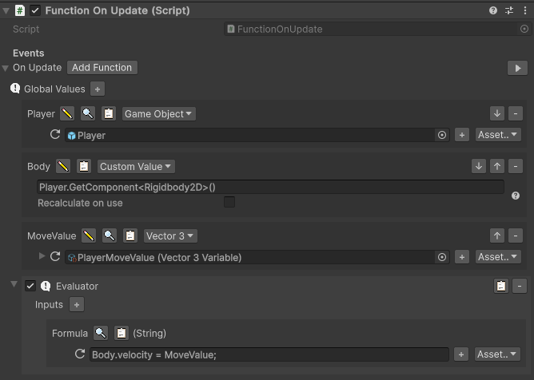

# Visual Functions
A tool to code small code logic or prototyping in Unity from the editor.
Designed to be more used by developers since most of the functions are using a code syntax to run the logic.

Use these tools to make your life easier:
- Variable: A scriptable object that contains a type
- Reference: A field that can accept a Variable or a local type
  
⚠️ This package is in development and can still change a lot, so be careful when using it in production ⚠️

## Example 
A system to move the player based on inputs WASD.

Here the inputs are stored in a variable called MoveValue, that is a reference to a Vector3 variable, that can be used everywhere.


And here the player use the MoveValue to move the player very simply.


More examples can be [here](./documentation/MoreExamples.md).

## Pros
- Easy to use
- No need to write code
- No need to compile
- Powerful logic very scalable
- Editable from the editor and when running
- Builtin components
- Can be extended with custom functions (code)
- Can add more types (code)

## Cons
The main cons is that it's way slower than writing code (150-300x slower) and that it can be hard to debug.
This can also be hard to use for non-developers to run logic beyond the basic operations (+, -, *, /, %, ==, !=, >, <, >=, <=).

## Features
Contains basic functions used to run code logic:
- Call Game Event: Trigger a game event
- For: Run a function for a number of times
- Loop: Run a function while a condition is met
- If: Run a function if a condition is met, else run another function
- Log: Log a list of inputs in the console
- Reset: Reset a variable to its default value
- Evaluate: Interpret a string as a code and run it

### Evaluate
Currently, the evaluate function supports all mathematical, logical and object methods operations.
For example, we have Vec that is a variable of type Vector3, we can do:
`Vec.x = Random.Range(Vec.y, Vec.z)` and it will set the x value of Vec to a random value between y and z.

Loop and For functions can also use the evaluate function to run a code logic.

#### Missing features
Doesn't support actually (but will be added): 
- new keyword for class instantiation
- Array access with []
- Ternary (?:) operator inside another ternary without parenthesis

## Install
In Unity, go to `Window` menu -> `Package Manager` -> `+` -> `install package from git url` and put this url:
```
https://github.com/Tryliom/TryliomFunctions.git
```

In Unity, you need to set the API compatibility level to `.NET Standard` in `Edit` -> `Project Settings` -> `Player` -> `Other Settings` -> `Configuration` -> `Api Compatibility Level`.

## Notes
Folder needed:
- `Resources/ScriptableObjects/Variables`: Where the game objects variables are stored
- `Resources/ScriptableObjects/GlobalVariables`: Where you need to store the global variables to be accessible from anywhere

You can change these folders path [here](./Scripts/Utility/ReferenceUtility.cs).

## Usage
todo

## Coding
### Add a reference
todo

### Add a function
todo