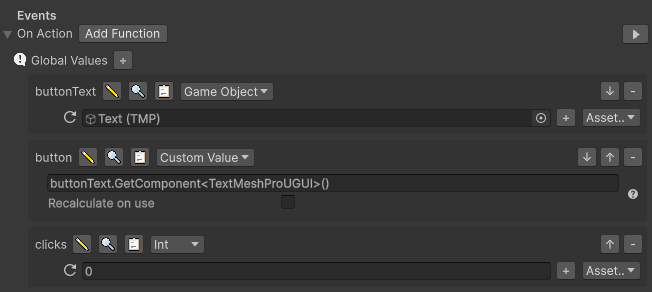
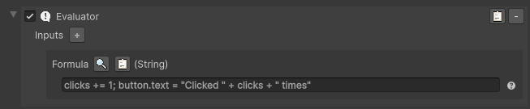
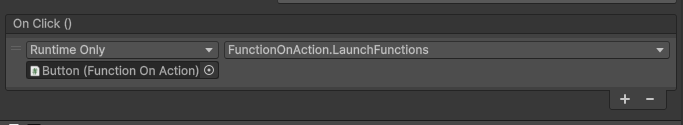

[Back](../MoreExamples.md)

# Button click
Here we use functions change the text of a button when clicked by the number of times.

Start by adding to your game object or the button the component `FunctionOnAction`, then add the `Evaluate` function to it from the button `Add function`.

Then, add global values named:
- `buttonText`, set his type to `GameObject`, then move the text of the button to it
- `button`, set his type to `CustomValue` and set the value to `buttonText.GetComponent<TextMeshProUGUI>()`, set recalculate to false
  - This will get the text component of the button on the first call
- `clicks`, set his type to `int` and set the value to 0

Then select the `Evaluator` function and set the value to `clicks += 1; button.text = "Clicked " + clicks + " times"`.

Then, on the button, add the `OnClick` event to your game object and select the `FunctionOnAction` component, then select the `LaunchFunctions` method.

Try it by clicking on the play button at the right of the `OnAction` event or by starting the game and click on the button.