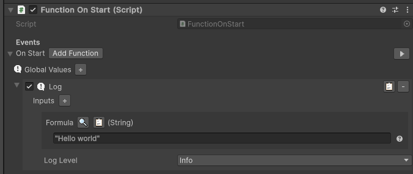

[Back](../MoreExamples.md)

# Hello world
Here we use functions to log "Hello World" in the console when the component is started.

Start by adding to your game object the component `Function On Start`, then add the `Log` function to it from the button `Add function`.

Then select the `Log` function and set the value to "Hello World".

Try it by clicking on the play button at the right of the `OnStart` event or by starting the game.